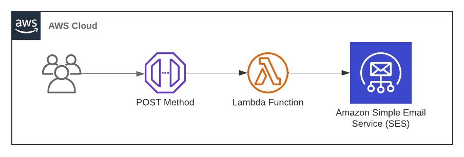

# Automatic Text Classifier
___

*Last updated: 2022-08-19*

## About
The purpose of this project is to expose a set of REST API endpoints to users which will let them do the following:
- **Model Training**: Upload a csv file with columns ```text``` and ```label```(0 and 1) and train a binary classifier in the backend.
  - Receive email alert on the completion of model training.
  - Retrieve the details of the model they trained.
- **Prediction**: Input a new text and select an existing classifier using with the input can be classified into either of classes.

**Note**: Size (memory and data count) limitations will be placed on the data the user inputs to the training endpoint.

---
## User-guide
### Register a user (mandatory):
- **Step-1**: Register user email using the POST method of the notification API. This allows AWS to identify the user via email address and send emails on completion of model training.
- **Step-2**: Open your email inbox and complete the verification process.
---
## Architecture
### 1. Registering a user


---
## Setting up environment with AWS
Do the following tasks in order 
([refer to this](https://docs.aws.amazon.com/toolkit-for-jetbrains/latest/userguide/setup-toolkit.html))
:

1. Get AWS user access key.
2. Install AWS Tooklit for PyCharm.
3. Install AWS CLI: Open command prompt and configure your aws user account by running ```aws configure```.
4. Docker.
5. AWS SAM CLI.
6. Install Terraform (for managing AWS resources).

### AWS resources utilized
- **Access Management and Networking**: IAM, API Gateway
- **Storage**: DynamoDB
- **Compute**: Lambda, ECS (Fargate)

### Terraform commands for resource management
```cd``` into the ```./terraform``` repository and use the following commands to intialize(init)
terraform in your project, deploy resources (apply) and destroy (destroy) them when you no
longer need them
```bash
$ terraform init
$ terraform apply -auto-approve
$ terraform destroy -auto-approve
```

### Commands to build and push Docker image to AWS ECR respository
**Note**: These commands are for Windows OS. Make sure the relevant ECR repository is already existing on the AWS cloud.
```bash
$ aws ecr get-login-password --region us-east-1 | docker login --username AWS --password-stdin <your_aws_account_id>.dkr.ecr.us-east-1.amazonaws.com
$ docker build -t textClassifier_development_training_image docker_images
$ docker tag textClassifier_development_training_image:latest <your_aws_account_id>.dkr.ecr.us-east-1.amazonaws.com/textclassifier_development_training_repository:textClassifier_development_training_image
$ docker push <your_aws_account_id>.dkr.ecr.us-east-1.amazonaws.com/textclassifier_development_training_repository:textClassifier_development_training_image
```
## REST API Methods

### Notification API
#### 1. POST method <span style="color:#ccaaaa;">(work in progress)</span>:
Description: Takes an email address of the user and sends verification link 

Endpoint URL example:

### Machine Learning Model API
#### 1. GET method:
Description: Takes a ```model_name``` parameter and retrieves the details of the item from DynamoDB table.
Below is an example endpoint, which is expecting to get details of a model named 'bohemian_rhapsody'.

Endpoint URL example: ```https://xxxxxxxxxx.execute-api.us-east-1.amazonaws.com/<stage_name>/<resource_path>?model_name=bohemian_rhapsody```

**Note**: 
1. The endpoint will return a ```500``` if 'queryStringParameters' are not passed.
2. If internal errors arise, the error message is caught and sent back as response body.

#### 2. POST method <span style="color:#ccaaaa;">(work in progress)</span>:
#### 
Description: 

Payload example:

#### 3. DELETE method <span style="color:#ccaaaa;">(work in progress)</span>:
Description: 

Payload example:

### Helpful references
1. [How do I deploy AWS Lambda using Terraform?](https://www.youtube.com/watch?v=JSR7U700h0U)
2. [Creating a serverless website using Terraform | AWS | Lambda | API Gateway](https://www.youtube.com/watch?v=wlVcso4Ut5o)
3. [Deploy Lambda Function and API Gateway using Terraform](https://levelup.gitconnected.com/deploy-lambda-function-and-api-gateway-using-terraform-d12cdc50dee8)
4. [How to use Terraform variables](https://upcloud.com/resources/tutorials/terraform-variables)