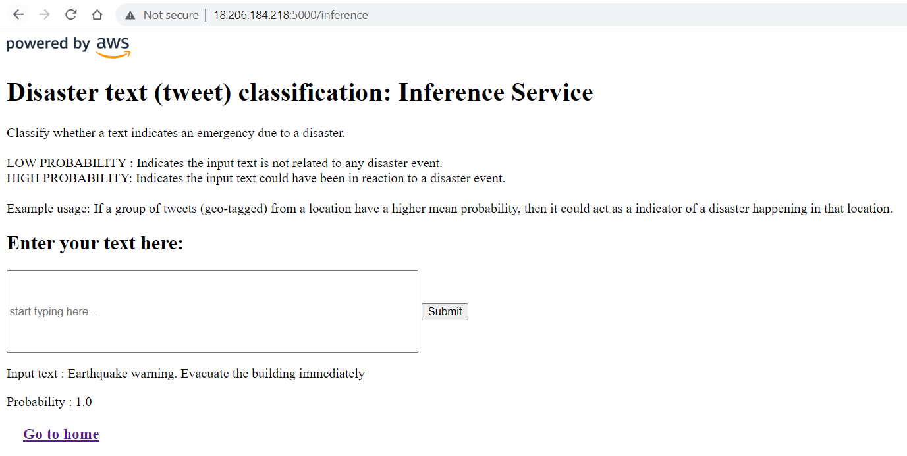

*Last Updated: April 13 2023*

### [(Click here) Divert to develop branch for documentation of user_management_service](https://github.com/gskpsrikar/text_classifier_on_aws/tree/develop)

## End-to-end Machine Learning Pipeline on AWS
###### #MLOps #MLEngineering #CloudDevelopment #AmazonWebServices #AWS
 

Deploying machine learning models into production is essential to realizing their full potential and generating value 
from the insights they provide. Without deployment, the models may only be used in isolated, ad hoc analyses or 
experiments, limiting their impact and reducing their ROI.

In this repository, I make an attempt to deploy neural network models and build API's to allow users access the models easily.

I used Amazon Web Services to deploy a Text Classification model built on Keras. Terraform is used to automate 
deployment and deletion of cloud resources thus saving potential oversight on resources. Flask API is used to wrap the 
models into APIs.

While my focus is on infrastructure, orchestration and identifying pitfalls in the process, I used simple HTML scripts to 
render the UI for the application, so it will be to understand what this application actually does, especially those who
are just starting MLOps and ML Engineering.

I need some starting point when it comes to a Neural Network. So I chose to build a small network 
using Keras trained to some extent and saved the model artifacts to AWS S3. The training is done on the 
[Disaster Tweet Classification dataset](https://www.kaggle.com/competitions/nlp-getting-started)
which is publicly available on the Kaggle website.

### Home Page of Application
Shows all the active end-points and provides links to navigate to corresponding URLs.

### The Inference Service
- AWS Resources: Elastic Container Service, Elastic Container Registry.

#### Using the Inference endpoints to get a prediction
A positive outcome example:  

A negative outcome example:  

